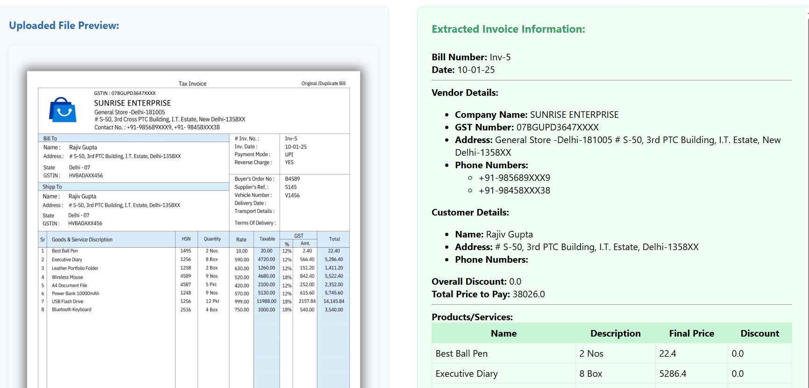

# Invoice Data Extractor

## Overview
This project extracts data from invoice documents using Python.

## How to Use

1. **Clone the repository**  
   ```
   git clone https://github.com/RishapParmar/invoscan.git
   ```

2. **Install dependencies**  
   ```
   pip install -r requirements.txt
   ```

3. **Add Gemini API Key**  
   Create a `.env` file in the project root and add your Gemini API key:
   ```
   GEMINI_API_KEY=your_gemini_api_key_here
   ```

4. **Run the extractor**  
   ```
   python app.py
   ```

## Features

- Extracts key invoice fields
- Supports multiple formats
- Easy to configure

## Image Placeholder




## License

MIT License
